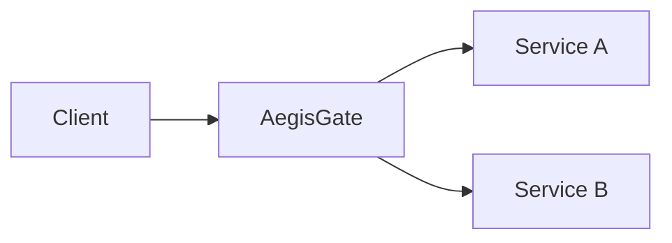

# 🛡️ AegisGate

### A security-first API gateway engineered in Go

AegisGate is an open engineering project exploring how a gateway can route traffic, enforce policies, and make backend activity easier to observe. The goal is to build each capability as a small, tested milestone and document the trade-offs along the way.

> **Status:** Early development. The `main` branch currently contains the product requirements and project notes. The gateway implementation and `v0.1.0` release are not yet present on this branch.

[Product requirements](PRD.md) · [Engineering notes](docs/PROJECT_MEMORY.md) · [Roadmap](#roadmap)

## Why AegisGate?

Applications with several backend services need a consistent entry point for routing, request correlation, traffic controls, and security policies. AegisGate is a hands-on way to design and measure that edge layer, from a working reverse proxy through later security and observability features.



The diagram describes the intended role of the gateway. See the [roadmap](#roadmap) for delivery status.

## Engineering focus

- **Go networking:** HTTP server behavior, reverse proxying, routing, and request lifecycle.
- **Security engineering:** explicit trust boundaries, policy enforcement, safe error handling, and testable assumptions.
- **Reliability:** timeouts, graceful shutdown, upstream failures, and measurable behavior under load.
- **Operations:** containerized local development, CI, structured logs, and eventually distributed deployment.

AegisGate is a learning and portfolio project. It is not an enterprise WAF, SIEM, or drop-in replacement for an established gateway.

## Roadmap

| Milestone | Scope | Status |
| --- | --- | --- |
| v0.1 · Gateway Foundation | HTTP server, prefix routing, reverse proxy, request IDs, logging, health checks, tests, Docker, and CI | Planned on `main` |
| v0.2 · Configurable Routing | Declarative routes, validation, route-specific settings, and policy metadata | Planned |
| v0.3 · Authentication | Identity and API access controls | Planned |
| v0.4 · Rate Limiting | Distributed traffic controls | Planned |
| v0.5 · WAF | Request inspection and rule evaluation | Planned |
| v0.6 · Detection | Security events and detection workflows | Planned |
| v0.7 · Observability | Metrics, traces, and operational visibility | Planned |
| v0.8 · Distributed Deployment | Deployment and resilience across instances | Planned |

Milestone details and proposed requirements live in [PRD.md](PRD.md). Roadmap entries are goals, not claims that the features already work.

## Current repository

```text
.
├── README.md                 # Project overview and status
├── PRD.md                    # Product requirements and long-term scope
└── docs/
    └── PROJECT_MEMORY.md     # Engineering decisions, risks, and open questions
```

The first runnable milestone will add setup instructions, example requests, configuration, architecture details, and test commands here when its code is available on `main`.

## Principles

1. Ship a working vertical slice before expanding the platform.
2. Prefer the Go standard library when it meets the requirement.
3. Test routing, proxy behavior, failures, and concurrency as features arrive.
4. Separate implemented capabilities from future plans.
5. Publish performance claims only with a reproducible benchmark and environment details.

## License

No license has been selected yet. Until a license is added, all rights are reserved by the repository owner.
