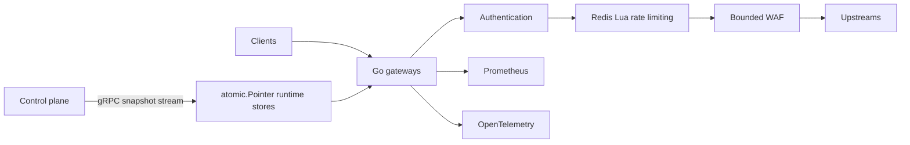

# AegisGate

[](https://github.com/Nuryanfa/AegisGate/actions/workflows/ci.yml)
[](go.mod)
[](https://github.com/Nuryanfa/AegisGate/releases/latest)

**AegisGate v0.8.0** is a Go API gateway that applies bounded request-security
policies and distributes validated routing configuration across multiple
gateway instances. It combines a small HTTP data path with a single-authority
gRPC control plane, without making the control plane part of each request.

This is an educational, production-like portfolio project, **not a claim of
production readiness**. API keys identify calling applications, not people.

## Why AegisGate?

An API gateway must reject untrusted or over-budget requests without obscuring
upstream behavior. Running several gateways adds another problem: route and
policy changes must be validated and applied consistently, while an outage of
the configuration authority must not destroy the last-known-good runtime.
AegisGate explores those trade-offs with explicit limits, failure policies,
observable outcomes, and atomic publication of complete configurations.

## Engineering highlights

- **Idiomatic Go:** standard-library `net/http` server and reverse proxy;
  boundary-aware routing, per-route deadlines, and structured `slog` output.
- **Concurrency with limits:** goroutines, bounded queues, one detector owner,
  fixed sink workers, non-blocking publication, and no goroutine per event.
- **Distributed configuration:** typed protobuf, bidirectional gRPC streaming,
  canonical revisions, ACK/NACK, bounded fan-out, reconnect/backoff, and
  `atomic.Pointer` swaps of immutable gateway runtimes.
- **Lifecycle:** context cancellation, bounded timeouts, health/readiness
  separation, and graceful shutdown.
- **Security and coordination:** digest-only API-client keys, scoped routes,
  Redis Lua atomic token buckets, and bounded audit/enforce WAF inspection.
- **Operability and evidence:** Prometheus metrics, OpenTelemetry traces with
  W3C context propagation, Docker demos, CI, race tests, bounded fuzz smoke
  tests, and [documented benchmark conditions](docs/benchmarks/v0.8-control-plane.md).

## Architecture at a glance



Authentication, rate limiting, and WAF run only when configured for a route;
the diagram shows their order. The control plane sends complete snapshots to
gateway-local stores. A request loads one runtime pointer, so in-flight
requests can finish on the runtime they already selected.

## Quick start

Requirements: Docker Compose for the demos, or Go 1.25.x for a local build.
Run commands from the repository root. Sample API-key digests are deliberately
non-working; the public `/api/users` route works without a key.

### Standard gateway demo

```sh
docker compose up -d --build
curl -i http://127.0.0.1:8080/api/users/42
curl -i http://127.0.0.1:8080/healthz
docker compose down
```

The default stack starts one gateway, Redis, and two example upstreams. The
public request should return `200`; `/api/orders/42` returns `401` without a
valid API key. The committed configuration also demonstrates shared Redis
quotas, WAF audit/enforce modes, and best-effort security-event logging.
Only gateway port 8080 is published; Redis is internal to Compose.

### v0.8 multi-gateway control-plane demo

```sh
docker compose --profile control-plane-demo up -d --build control-plane gateway-cp-a gateway-cp-b users-upstream orders-upstream
curl -i http://127.0.0.1:8084/api/users/42
curl -i http://127.0.0.1:8085/api/users/42
docker compose --profile control-plane-demo down
```

Both gateways bootstrap locally and receive the same validated snapshot.
To demonstrate an update, change the users upstream in
[`configs/snapshots/example.yaml`](configs/snapshots/example.yaml) to
`http://orders-upstream:8081`, then run
`docker compose kill -s HUP control-plane` **before** the `down` command.
Check ACKs with `docker compose logs control-plane gateway-cp-a gateway-cp-b`;
restore the tracked example file after the demo. The demo uses **insecure
development-only gRPC**; production configuration requires mTLS. See the
[control-plane guide](docs/control-plane.md) for update, outage, and recovery
behavior.

## What the gateway enforces

Requests pass through one boundary-aware longest-prefix route match, optional
API-client authentication and all-required scope authorization, optional
Redis rate limiting, optional WAF inspection, then the reverse proxy.
`/api/users` matches `/api/users/42` but not `/api/users-v2`; `/` may be a
catch-all. `/healthz` and `/readyz` are gateway-owned. Non-canonical paths are
rejected rather than falling through to a broader route.

Each route explicitly chooses `public` or `api_key`. Protected routes require
exactly one `X-API-Key` header; only SHA-256 digests belong in configuration.
The gateway strips or rebuilds client-supplied forwarding and identity headers
before proxying. Public rate-limit subjects use the direct socket peer,
**not** untrusted `X-Forwarded-*` claims. There is no trusted-proxy client-IP
model yet; users behind one NAT may share a public quota.

Redis uses one Lua operation to refill, decide, consume, and expire a token
bucket atomically across gateway instances. Routes explicitly choose whether
Redis failure denies traffic (`503`) or allows it without quota enforcement;
there is no implicit fail-open mode. Exhausted buckets return JSON `429` and
`Retry-After`. Readiness becomes unavailable during a Redis outage when a
route uses fail-closed limiting.

The small, signature-based WAF supports `disabled`, `audit`, and `enforce`.
It inspects configured request fields within byte, depth, and element limits.
Audit forwards scored requests; enforce can return JSON `403`. Parsing limits
still apply in audit mode. Multipart files are not scanned. WAF decisions are
synchronous; the separate security-event pipeline is bounded, process-local,
non-durable, and may drop events under load. Its detector correlates rule
matches and blocks only within one process. See the
[WAF decision](docs/adr/0003-bounded-request-inspection.md) and
[event-pipeline decision](docs/adr/0004-asynchronous-security-event-pipeline.md).

Per-route deadlines must be shorter than the server write timeout. Unknown
paths return JSON `404`, unavailable upstreams `502`, and pre-response
timeouts `504`. Once upstream response bytes have started, HTTP cannot replace
a partial response with a fresh JSON error. Incoming paths are preserved;
configured upstream base paths are prepended by the reverse proxy.

## Configuration model

`AEGIS_CONFIG_PATH` selects a required, strict YAML bootstrap file. Start with
[`configs/config.example.yaml`](configs/config.example.yaml) for a local Go
process or [`configs/config.docker.yaml`](configs/config.docker.yaml) for the
default Compose demo. Unknown fields, duplicate IDs or prefixes, invalid URLs,
contradictory policies, and unsafe timeouts fail startup. Secrets are supplied
through the environment or protected mounts, not committed YAML.

```yaml
routes:
  - id: users
    path_prefix: /api/users
    upstream: http://localhost:8081
    timeout: 5s
    auth:
      mode: public
  - id: orders
    path_prefix: /api/orders
    upstream: http://localhost:8082
    timeout: 8s
    auth:
      mode: api_key
      required_scopes: [orders:read]
```

The protected route additionally needs a matching digest-only `api_keys`
entry. `go run ./cmd/keygen` prints a new plaintext key once and its SHA-256
digest; deliver the key through a secret manager and commit only the digest.
For server settings, precedence is **environment override → YAML → built-in
default**. Routes and API-key digests come from YAML; Redis ACL credentials
come only from `AEGIS_REDIS_USERNAME` and `AEGIS_REDIS_PASSWORD`.

Without `control_plane`, route and key changes require a restart. In
control-plane mode, routes, policies, and API clients can change via validated
remote snapshots and one atomic runtime swap; listeners, Redis credentials,
TLS keys, telemetry, and security-event capacity remain node-local and
restart-only. The single-authority control plane holds no durable history or
consensus state. Invalid snapshots are NACKed without replacing the active
runtime. An unchanged revision is ACKed without recompilation.

The authority sends heartbeats every 30 seconds. Freshness uses the last valid
snapshot or heartbeat on the configured stream, not the age of the last
configuration change; `stale_after` is at least one minute. `stale_policy:
serve` keeps the last-known-good runtime during an outage, while `deny`
returns JSON `503 CONFIG_STALE` after contact expires. The development demo's
plaintext stream does **not** authenticate its peer. Production requires mTLS
on both sides. See [ADR 0006](docs/adr/0006-grpc-control-plane.md) and the
[control-plane guide](docs/control-plane.md) for the protocol, bootstrap,
backpressure, and failure contracts.

## Operability and evidence

Prometheus uses a separate telemetry listener; the Compose metrics listener
is internal, not exposed on the public gateway port. Tracing uses a bounded
OTLP HTTP exporter, W3C TraceContext, and sanitized propagation across HTTP
and gRPC. Exporter outages do not change authorization or readiness, but
buffered spans can be lost. Metrics avoid request-derived high-cardinality
labels; traces do not include request bodies, query strings, or WAF evidence.
Access logs still contain paths and direct peer addresses, so protect their
retention. See [observability operations](docs/observability.md),
[SLIs/SLOs](docs/observability/slis-slos.md), and
[ADR 0005](docs/adr/0005-operational-observability.md).

To explore the local observability stack:

```sh
docker compose --profile observability up -d --build
docker compose --profile observability down
```

Prometheus is published on `127.0.0.1:9091`, Jaeger on `127.0.0.1:16686`,
and Grafana on `127.0.0.1:3000`. The Compose stack is a demo, not a hardened
or durable telemetry deployment. The gateway image accepts static, non-secret
build metadata:

```sh
docker build -f deployments/docker/Dockerfile --target gateway \
  --build-arg VERSION=v0.8.0 \
  --build-arg COMMIT=abc123def456 \
  --build-arg BUILD_TIME=2026-10-03T12:00:00Z \
  -t aegisgate:v0.8.0 .
```

Compose also accepts `AEGIS_BUILD_VERSION`, `AEGIS_BUILD_COMMIT`, and
`AEGIS_BUILD_TIME` (defaults: `dev`, `unknown`, `unknown`). These values are
fixed for the image lifetime and appear in startup metadata and
`aegisgate_build_info`; never put secrets in them.

CI checks formatting, protobuf generation, vet, tests, the race detector,
bounded fuzz smoke tests, Go builds, and Docker builds. Reproduce core checks:

```sh
go test ./...
go test -race ./...
go vet ./...
go build ./...
docker compose config
docker compose --profile control-plane-demo config
```

Redis integration tests require a reachable instance via
`AEGIS_REDIS_INTEGRATION_ADDR`; CI supplies one. Benchmarks are deliberately
narrow and record setup, inputs, and limitations rather than claiming
production throughput:
[WAF v0.5](docs/benchmarks/v0.5-waf.md),
[security events v0.6](docs/benchmarks/v0.6-security-events.md),
[observability v0.7](docs/benchmarks/v0.7-observability.md), and
[control plane v0.8](docs/benchmarks/v0.8-control-plane.md).

## Security boundaries

An API key is a bearer credential, not end-user identity or resource-level
authorization. Use TLS, rotate keys, and keep plaintext outside source
control. Rate limiting is not DDoS protection. The WAF is not OWASP CRS,
malware scanning, or proof that a request is safe; upstreams still need
parameterized queries, contextual output encoding, input validation, and
their own authorization. The event pipeline is not a durable audit log, SIEM,
or cross-instance detector. No PostgreSQL, admin API, persistent rollback,
or highly available control-plane authority is included in v0.8.

See the [API-key trust model](docs/adr/0001-api-client-key-trust-model.md),
[Redis rate-limit decision](docs/adr/0002-redis-token-bucket-rate-limiting.md),
[WAF decision](docs/adr/0003-bounded-request-inspection.md), and
[control-plane decision](docs/adr/0006-grpc-control-plane.md) for precise
security and failure assumptions.

## Roadmap

| Milestone | Scope | Status |
| --- | --- | --- |
| v0.1–v0.3 | Gateway, routing, and API-client authorization | Implemented |
| v0.4 | Distributed Redis rate limiting | Released (`v0.4.0`) |
| v0.5 | Bounded WAF inspection | Released (`v0.5.0`) |
| v0.6 | Asynchronous security events and process-local detection | Released (`v0.6.0`) |
| v0.7 | Metrics, tracing, and operational observability | Released (`v0.7.0`) |
| v0.8 | gRPC control plane and atomic distributed configuration | Released (`v0.8.0`) |

`main` carries reviewed releases; `develop` is the integration branch.
Architecture decisions live in [`docs/adr/`](docs/adr/) and the
[project memory](docs/PROJECT_MEMORY.md) records confirmed scope.

## License

No license has been selected. Until one is added, all rights are reserved.
