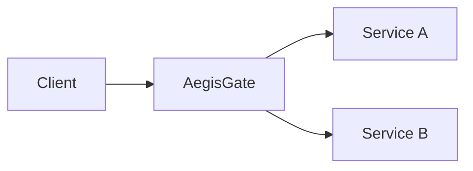

# 🛡️ AegisGate

### A security-first API gateway engineered in Go

AegisGate is a portfolio-grade, cloud-native API gateway and security platform
built primarily in Go. The project develops each capability as a small, tested
milestone and documents the engineering trade-offs along the way.

> **Status:** `v0.1` Gateway Foundation is stable on `main`. `v0.2`
> Configurable Routing is implemented on `develop` and awaiting promotion.

[Product requirements](PRD.md) · [Engineering notes](docs/PROJECT_MEMORY.md) ·
[Roadmap](#roadmap)

## Why AegisGate?

Applications with several backend services need a consistent entry point for
routing, request correlation, traffic controls, and security policies.
AegisGate is a hands-on exploration of that edge layer, beginning with a
working reverse proxy and expanding through later security and observability
milestones.



AegisGate is an engineering portfolio project. It is not an enterprise WAF,
SIEM, or drop-in replacement for an established gateway.

## Engineering focus

- **Go networking:** HTTP lifecycle, routing, and reverse proxying
- **Security:** explicit trust boundaries, safe errors, and testable assumptions
- **Reliability:** timeouts, graceful shutdown, and upstream failure handling
- **Operations:** containers, CI, structured logs, and reproducible validation

## Current capabilities

- Explicitly configured `http.Server`
- Deterministic exact and longest-prefix route matching
- Reverse proxying with `net/http/httputil`
- Cryptographically random or client-preserved request IDs
- Structured request logging with `log/slog`
- Liveness and readiness endpoints
- Consistent JSON gateway errors
- Graceful `SIGINT` and `SIGTERM` shutdown
- Unit and integration-style proxy tests
- Minimal, non-root Docker images and a two-service Compose demo
- GitHub Actions validation
- Strict YAML configuration loaded at startup
- Multiple upstream routes with path-boundary matching
- Per-route upstream deadlines with JSON `504` responses

## Requirements

- Go 1.25.x
- Docker with Compose for the containerized demo
- `make` is optional; every target maps to a documented Go command

## Project structure

```text
cmd/
  gateway/           AegisGate process and dependency composition
  example-upstream/  Small backend used for the end-to-end demo
internal/
  config/            Environment parsing and validation
  middleware/        Request ID and request logging middleware
  proxy/             Reverse proxy dispatch and gateway errors
  router/            Deterministic route matching
  server/            HTTP server lifecycle and health handlers
configs/              Future file-config shape (not loaded in Sprint 0)
deployments/docker/   Multi-stage, non-root container build
```

## Configuration

`AEGIS_CONFIG_PATH` is required and selects one YAML file. Route definitions
come only from that file. Server settings use this precedence, from highest to
lowest:

```text
environment variable → YAML server value → built-in default
```

The supported server overrides are:

| Variable | Default | Purpose |
| --- | --- | --- |
| `AEGIS_ENV` | `development` | Text logs in development; JSON otherwise |
| `AEGIS_CONFIG_PATH` | none | Required path to the YAML configuration |
| `AEGIS_HTTP_ADDR` | `:8080` | Gateway listen address |
| `AEGIS_READ_TIMEOUT` | `10s` | Request read timeout |
| `AEGIS_WRITE_TIMEOUT` | `15s` | Response write timeout |
| `AEGIS_IDLE_TIMEOUT` | `60s` | Keep-alive idle timeout |
| `AEGIS_SHUTDOWN_TIMEOUT` | `10s` | Graceful shutdown deadline |

Routes are declared in YAML:

```yaml
routes:
  - id: users
    path_prefix: /api/users
    upstream: http://localhost:8081
    timeout: 5s

  - id: orders
    path_prefix: /api/orders
    upstream: http://localhost:8082
    timeout: 8s
```

Configuration is loaded once at startup; changing the file requires a gateway
restart. Unknown YAML fields are rejected. IDs and prefixes must be unique,
timeouts must be positive, and upstreams must be absolute `http` or `https`
URLs without credentials, query strings, or fragments.

`path_prefix` is canonical and has no trailing slash except for `/`. Matching
respects segment boundaries: `/api/users` matches itself and
`/api/users/42`, but not `/api/users-v2`. The longest matching prefix wins.
`/` is an optional catch-all route, while `/healthz` and `/readyz` remain
reserved gateway endpoints.

Incoming paths are not stripped. If an upstream includes a base path such as
`http://service:8080/internal`, `/api/users` is forwarded as
`/internal/api/users` using Go's standard reverse-proxy path joining.

The v0.1 `AEGIS_UPSTREAM_URL` variable is no longer accepted. Move that URL
into a route in the YAML file and set `AEGIS_CONFIG_PATH`. See
[`configs/config.example.yaml`](configs/config.example.yaml) and
[`.env.example`](.env.example).

## Running locally

Start two named example upstreams in separate PowerShell terminals:

```powershell
$env:EXAMPLE_SERVICE_NAME="users-upstream"
$env:EXAMPLE_HTTP_ADDR=":8081"
go run ./cmd/example-upstream
```

```powershell
$env:EXAMPLE_SERVICE_NAME="orders-upstream"
$env:EXAMPLE_HTTP_ADDR=":8082"
go run ./cmd/example-upstream
```

Start the gateway in a third terminal:

```powershell
$env:AEGIS_CONFIG_PATH="configs/config.example.yaml"
go run ./cmd/gateway
```

Then exercise the gateway:

```bash
curl -i http://localhost:8080/healthz
curl -i http://localhost:8080/readyz
curl -i http://localhost:8080/api/users/42
curl -i http://localhost:8080/api/orders/99
```

The proxied response includes `X-Request-ID`. Supplying the header yourself
preserves the value:

```bash
curl -i -H 'X-Request-ID: demo-123' http://localhost:8080/api/users/42
```

## Running with Docker

```bash
docker compose up --build
```

Compose starts `gateway`, `users-upstream`, and `orders-upstream`. It mounts
`configs/config.docker.yaml` read-only, and upstream URLs use Compose service
names. Only gateway port `8080` is published to the host.

Stop the stack with `Ctrl+C` or:

```bash
docker compose down
```

## Available endpoints

| Method | Path | Behavior |
| --- | --- | --- |
| `GET` | `/healthz` | Process liveness, returning `{"status":"ok"}` |
| `GET` | `/readyz` | Gateway readiness, returning `{"status":"ok"}` |
| Any | `/api/users[/...]` | Proxies to the configured users upstream |
| Any | `/api/orders[/...]` | Proxies to the configured orders upstream |

Unmatched paths return JSON `404`, unreachable upstreams return JSON `502`, and
route deadline expiration returns JSON `504`. Internal transport details are
not exposed.

## Architecture flow

```text
client
  -> request ID middleware
  -> structured request logging
  -> health/readiness or longest boundary-aware prefix match
  -> route-specific timeout
  -> reverse proxy (sanitized forwarding headers)
  -> configured upstream
```

Client-provided `Forwarded` and `X-Forwarded-*` values are not trusted. The
proxy rebuilds `X-Forwarded-For`, `X-Forwarded-Host`, and `X-Forwarded-Proto`
from the connection observed by AegisGate. The upstream receives its own host
in `Host` and the original public host in `X-Forwarded-Host`.

## Testing and checks

```bash
go test ./...
go test -race ./...
go vet ./...
go build ./...
```

Or use the convenience targets:

```bash
make fmt
make tidy
make check
make test-race
make build
```

## Development workflow

- `main` is the stable branch and contains only reviewed, validated code.
- `develop` is the integration branch for the next milestone and ongoing work.
- Create short-lived feature branches from `develop`, then merge them back
  through pull requests after CI passes.
- Promote `develop` to `main` only when the milestone definition of done is met.

## Roadmap

| Milestone | Scope | Status |
| --- | --- | --- |
| v0.1 · Gateway Foundation | HTTP server, prefix routing, proxy, request IDs, logging, health, tests, Docker, and CI | Implemented |
| v0.2 · Configurable Routing | Declarative routes, validation, per-route upstreams, and timeouts | Implemented on `develop` |
| v0.3 · Authentication | Identity and API access controls | Next |
| v0.4 · Rate Limiting | Distributed traffic controls | Planned |
| v0.5 · WAF | Request inspection and rule evaluation | Planned |
| v0.6 · Detection | Security events and detection workflows | Planned |
| v0.7 · Observability | Metrics, traces, and operational visibility | Planned |
| v0.8 · Distributed Deployment | Deployment and resilience across instances | Planned |

Milestone details and proposed requirements live in [PRD.md](PRD.md). Roadmap
entries are goals, not claims that unimplemented features already work.

## Current limitations

Configuration reload is restart-only; there is no hot reload or remote control
plane. Route configuration deliberately has no inert authentication, rate
limit, or WAF flags. The project still does not include a database, Redis,
authentication, authorization, rate limiting, WAF rules, durable event queues,
an observability stack, WebSocket-specific policy, a control plane, or a
frontend. TLS termination and trusted-proxy topology are also deployment
concerns not configured in this milestone.

## Principles

1. Ship a working vertical slice before expanding the platform.
2. Prefer the Go standard library when it meets the requirement.
3. Test routing, proxy behavior, failures, and concurrency as features arrive.
4. Separate implemented capabilities from future plans.
5. Publish performance claims only with a reproducible benchmark and environment details.

## Next milestone

The next logical milestone is **v0.3 — Authentication and Authorization
Foundation**. It should define a real trust model and enforcement behavior
before adding any protective-looking route policy flags.

## License

No license has been selected yet. Until a license is added, all rights are
reserved by the repository owner.
